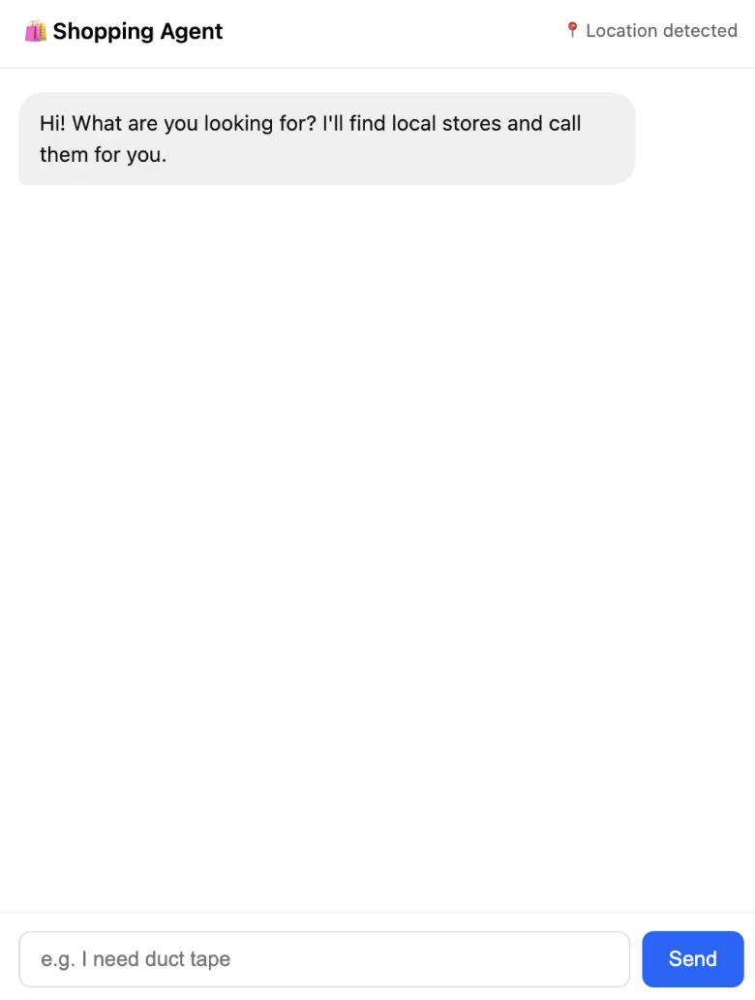
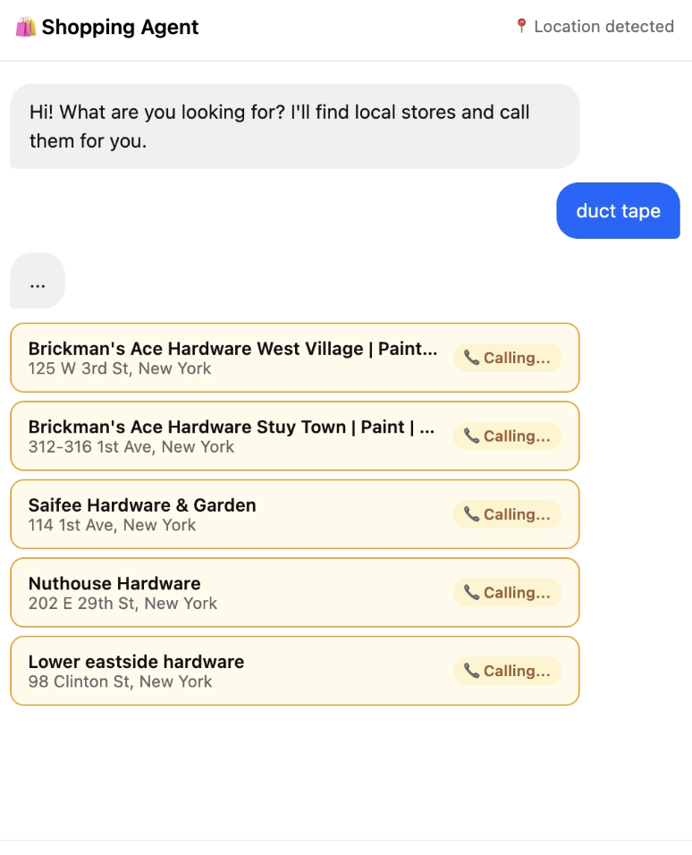
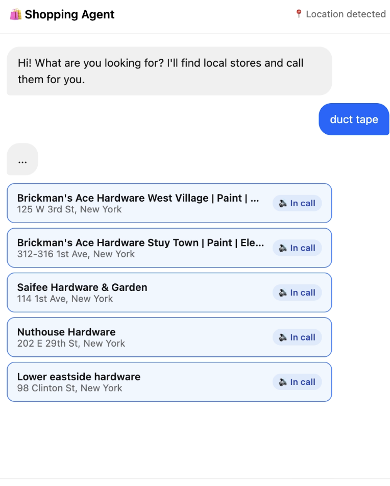
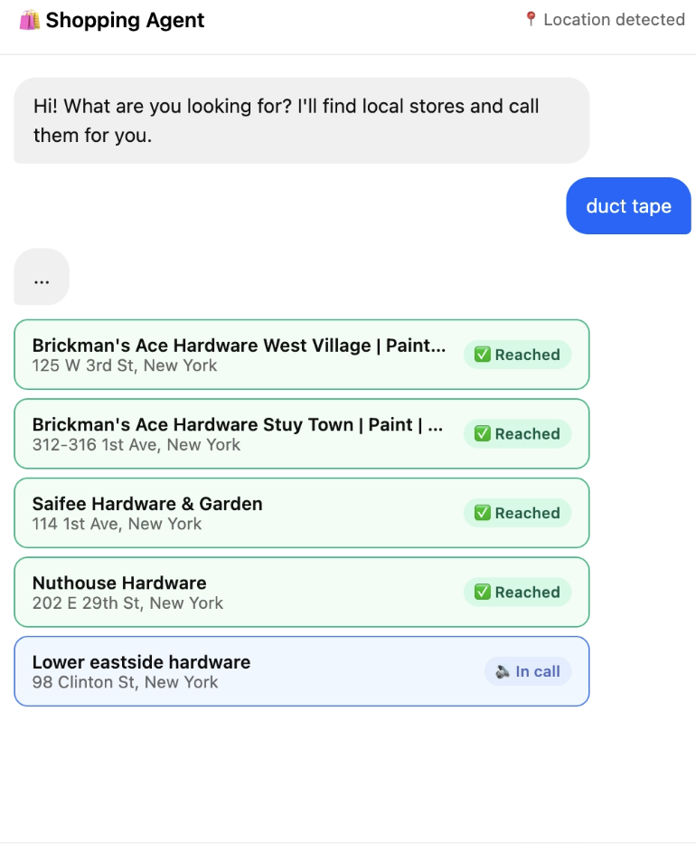

# ShopCallAI

An AI voice agent that calls local stores on your behalf to check if a product is in stock — so you don't have to.

---

## The Problem

When you search for a product online, you get two kinds of results:

1. **Online retailers** — Amazon, eBay, etc. You'll wait days for delivery.
2. **Big-box chains** — Walmart, Target, Best Buy. They have online inventory systems.

**Local stores are invisible.** The independent hardware store two blocks away, the neighborhood pharmacy, the small electronics shop — they don't have real-time inventory APIs. They don't show up in "near me" searches with stock status. The only way to know if they have what you need is to call them.

Most people don't. It's tedious. You'd have to find the numbers, call each one, wait on hold, and repeat for every store. So you either drive around hoping, or you just order online and wait.

**Local stores lose sales. You waste time.**

---

## The Solution

ShopCallAI bridges that gap. You type what you need. The agent:

1. **Detects your location** (via browser geolocation or text)
2. **Finds nearby relevant stores** using Google Maps
3. **Calls every store** using a voice AI agent
4. **Reports back** which stores have it, at what price

You go from "I need duct tape" to knowing exactly which hardware stores near you have it in stock — in under two minutes, without making a single call yourself.

---

## Demo

**Step 1 — Tell the agent what you need**



**Step 2 — Agent finds nearby stores and starts calling**



**Step 3 — Voice agent is live on each call simultaneously**



**Step 4 — Results come in as calls complete**



---

## How It Works

```
You type "I need duct tape"
        ↓
Agent detects your location
        ↓
Google Maps finds nearby hardware stores
        ↓
Voice AI calls all stores in parallel
  → "Hi! Do you have duct tape in stock?"
  → "What's the price?"
        ↓
Results stream back
        ↓
You get a summary: which stores have it + price
```

---

## Services Used

| Service | Purpose |
|---------|---------|
| **Google Maps API** | Find nearby stores by product type, fetch phone numbers |
| **VoiceRun** | Deploy and run the voice AI agent that makes phone calls |
| **Baseten** | Host the LLM used for product extraction, clarification, and report generation |
| **MongoDB** | Persist call outcomes |

---

## Setup

### Prerequisites

- Python 3.11+
- MongoDB instance
- API keys: Google Maps, VoiceRun, Baseten

### Install

```bash
pip install -r requirements.txt
```

### Configure

Copy `.env.example` to `.env` and fill in:

```env
GOOGLE_MAPS_API_KEY=...
VOICERUN_API_KEY=...
VOICERUN_AGENT_ID=...
VOICERUN_FROM_PHONE=...
VOICERUN_WEBHOOK_URL=...
BASETEN_API_KEY=...
BASETEN_BASE_URL=...
BASETEN_MODEL=...
MONGODB_URI=...
MONGODB_DB=shopping_agent
```

> `VOICERUN_WEBHOOK_URL` must be a publicly accessible URL — VoiceRun needs to POST call outcomes back to your server.


## Project Structure

```
├── main.py              # FastAPI app entry point
├── orchestrator.py      # 6-step state machine (location → product → stores → calls → report)
├── state.py             # In-memory session & progress state
├── config.py            # Environment config
├── llm.py               # LLM client (Baseten / OpenAI-compatible)
├── routers/
│   ├── chat.py          # POST /chat, GET /progress/{session_id}
│   └── webhooks.py      # VoiceRun call outcome webhooks
├── services/
│   ├── geo.py           # Location parsing and geocoding
│   ├── places.py        # Google Maps store discovery
│   ├── calls.py         # VoiceRun call orchestration
│   └── report.py        # LLM result summarization
├── static/
│   └── index.html       # Chat UI
└── voicerun_agent/
    └── shopping-caller/
        └── handler.py   # Voice agent logic (stock check + price)
```
